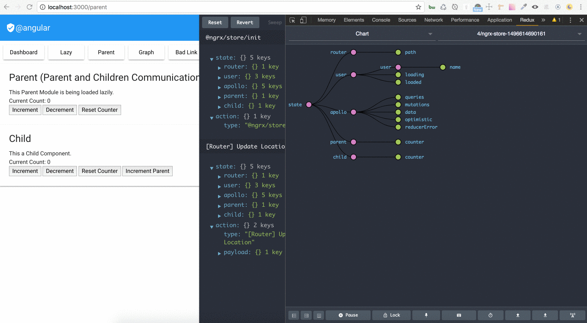

# Re-learning Angular



## Original Repository

 * https://github.com/josoroma/angular-webpack2-starter/tree/master

```
git remote set-url origin git://github.com/qdouble/angular-webpack2-starter.git

git remote set-url --push origin git@github.com:josoroma/angular-webpack2-starter.git
```

```
git remote -v

origin  git://github.com/qdouble/angular-webpack2-starter.git (fetch)
origin  git@github.com:josoroma/angular-webpack2-starter.git (push)
```

 * https://github.com/qdouble/angular-webpack2-starter

## Angular Universal

 - https://universal.angular.io/overview

At a high level, there are two major pieces to the Angular Universal:

 * Rendering on the server which means generating all the HTML for a page at a given route.

 * Transitioning from the server view to the client view in the browser client.

## Server

 * src/server.ts

 * src/app/server.app.module.ts

## Routes

 * src/server.routes.ts

 * src/app/app.routing.ts

## APP

 * src/app/app.module.ts

## State / Reducers

 * src/app/reducers/index.ts

 * src/modules/transfer-state/browser-transfer-state.module.ts

## APP_*

### APP_DECLARATIONS

 * src/app/app.declarations.ts

### APP_ENTRY_COMPONENTS

 * src/app/app.entry-components.ts

### APP_IMPORTS

 * src/app/app.imports.ts

### APP_PROVIDERS

 * src/app/app.providers.ts

## RxJS powered state management inspired by Redux

 * https://github.com/ngrx/store

@ngrx/store is a controlled state container designed to help write performant, consistent applications on top of Angular. Core tenets:

 * State is a single immutable data structure.

 * Actions describe state changes.

 * Pure functions called reducers take the previous state and the next action to compute the new state.

 * State accessed with the Store, an observable of state and an observer of actions.

These core principles enable building components that can use the OnPush change detection strategy giving you intelligent, performant change detection throughout your application.

## Comprehensive Introduction to @ngrx/store

 * https://gist.github.com/btroncone/a6e4347326749f938510

### ngrx-store-freeze

Freezing state in development is the recommended path to take if we want to guarantee there are no unnecessary state mutations.

```
import { storeFreeze } from 'ngrx-store-freeze';

...

const DEV_REDUCERS = [stateSetter, storeFreeze];

...

const developmentReducer = compose(...DEV_REDUCERS, resetOnLogout);
```

`ngrx-store-freeze` is used as a meta-reducer to freeze any object that enters the store. On another place, when an object needs to be changed, a shallow copy is being made. `Object.assign()` doesn't do deep copy. A member of another object reached from the original object is being modified. This secondary object is also frozen, by it is not duplicated.

*Solution*

Use a deep copy like `cloneDeep()` from `lodash`. Or sent a bag of properties to be changed with a proper action. Process the changes on the reducer.

### Don't mutate data that's in the store

Certainly a freeze during development to try to prevent writing code that does this is a good idea.

By the way, the object `spread operator`, saves considerable `Objects.assign()` syntax tedium when implementing code in reducers and elsewhere to avoid in-place mutation!

#### Enforcing immutability

 * https://angular-2-training-book.rangle.io/handout/change-detection/enforcing_immutability.html
